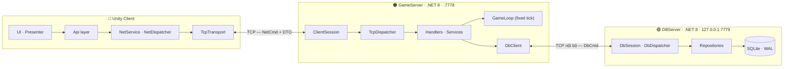

# MMORPG — dựng một game online 2D từ số 0

> Game nhập vai online 2D góc nhìn ngang (kiểu *Ninja School* / *Ngọc Rồng Online*), viết lại **toàn bộ
> từ đầu**: client Unity, game server, database server — không dùng Photon, Mirror, Netcode hay bất kỳ
> framework mạng dựng sẵn nào.
>
> **Đây là dự án học.** Mục tiêu không phải là ra được game, mà là hiểu *vì sao* MMO phải làm như vậy:
> vì sao TCP cần đóng khung gói tin, vì sao database phải là một tiến trình riêng, vì sao client không
> bao giờ được tự quyết vị trí của chính nó. Mỗi quyết định kỹ thuật đều có tài liệu giải thích lý do.

<!-- TODO: chèn ảnh/GIF gameplay khi có asset -->

---

## Mục lục

- [Game này là gì](#game-này-là-gì)
- [Kiến trúc](#kiến-trúc)
- [Tech stack](#tech-stack)
- [Kỹ thuật & thuật toán](#kỹ-thuật--thuật-toán)
- [Tính năng](#tính-năng)
- [Cấu trúc thư mục](#cấu-trúc-thư-mục)
- [Chạy thử](#chạy-thử)
- [Tài liệu](#tài-liệu)

---

## Game này là gì

| | |
|---|---|
| **Thể loại** | MMORPG 2D, platformer góc nhìn ngang |
| **Nền tảng** | PC (Windows), Unity 6 |
| **Mô hình mạng** | Client–server, **server authoritative** — client chỉ gửi *ý định*, server quyết mọi thứ |
| **Nhân vật** | 1 tài khoản = 1 nhân vật, tự tạo trong lần vào world đầu tiên |
| **Quy mô** | Vài chục người chơi cùng lúc — đủ để mọi bài toán MMO thật (đồng bộ, AOI, băng thông) xuất hiện |

**Nguyên tắc xuyên suốt: server là nguồn sự thật duy nhất.** Client không bao giờ tự sửa máu, vị trí hay
túi đồ của mình; nó gửi ý định lên, chờ server xác nhận, rồi mới cập nhật màn hình. Client cũng **không bao
giờ** nối trực tiếp tới database.

---

## Kiến trúc

Ba tiến trình độc lập, hai đường TCP, một contract dùng chung.



**Vì sao tách DBServer thành tiến trình riêng?** Truy vấn DB là I/O chậm và không đoán trước được thời
gian. Nếu game loop gọi thẳng SQLite, một truy vấn nặng sẽ làm nghẽn tick của **tất cả** người chơi. Tách
ra rồi giao tiếp async khiến điều đó không thể xảy ra. Đổi lại phải tự viết một protocol nội bộ nữa —
và đó chính là bài học.

**Vì sao `Shared` build ra DLL cho Unity thay vì chép file?** Mã lệnh `NetCmd` và mọi DTO chỉ tồn tại ở
**một** nơi: `Server/Shared/`. Build xong DLL tự copy sang `Assets/Plugins/Shared/`. Chép tay enum sang
Unity thì sớm muộn hai bên lệch số, và lỗi đó **không có thông báo** — chỉ có gói tin rơi vào hư không.

### Khung gói tin

```
┌─────────────┬─────────────┬───────────────────────┐
│ int32 len   │ int32 cmd   │ payload (len - 4 byte)│   len = 4 + payload.Length, little-endian
└─────────────┴─────────────┴───────────────────────┘

payload:
┌──────────┬───────────────────────┬──────────────────┐
│ flag 1B  │ rawLen 4B (nếu flag=1)│ MemoryPack bytes │   flag 0x00 = thô · 0x01 = nén LZ4 (chỉ khi > 4KB)
└──────────┴───────────────────────┴──────────────────┘
```

---

## Tech stack

### Client

| Công nghệ | Dùng để |
|---|---|
| **Unity 6000.2.9f1** + **URP 2D** | Engine, pipeline render 2D |
| **VContainer** | Dependency injection — nguồn duy nhất khai báo client có những gì |
| **UniTask** | Async không cấp phát, và cầu nối `SwitchToMainThread` từ socket thread về Unity |
| **MemoryPack** | Serialize DTO nhị phân |
| **Addressables 2.9** | Load asset, và về sau là hot update nội dung qua CDN |
| **Input System**, **2D Tilemap**, **2D Animation / Aseprite** | Input, map, animation nhân vật |
| **`com.hungnt.*`** (9 package tự viết, submodule) | `core` (log, singleton, lifecycle) · `eventbus` · `objectpool` · `assetload` · `dataconfig` · `datasave` · `ui` / `ui.panel` / `ui.tween` |

### Server

| Công nghệ | Dùng để |
|---|---|
| **.NET 8** | GameServer + DBServer |
| **`System.Net.Sockets`** thuần | TCP — không framework mạng, tự viết framing và session |
| **SQLite** (WAL) → **MySQL** về sau | Lưu tài khoản, nhân vật, túi đồ |
| **MemoryPack** + **K4os LZ4** | Serialize + nén payload lớn |
| **Lua** (dự kiến) | Script hoá công thức chiến đấu / drop / AI quái, hot reload không restart |

### Dùng chung

| | |
|---|---|
| **`MMORPG.Shared`** — `netstandard2.1` + `net8.0` | `NetCmd`, `DbCmd`, mọi DTO, codec khung gói tin, và **luật di chuyển** — một nguồn duy nhất cho cả 3 bên |
| **xUnit** | Test cho phần dễ sai nhất: ghép gói dở, nén/giải nén |

---

## Kỹ thuật & thuật toán

Danh sách những thứ được cài **bằng tay** trong dự án này, không phải gọi thư viện:

| Kỹ thuật | Giải quyết vấn đề gì | Phase |
|---|---|---|
| **Length-prefix framing** | TCP là *stream* không có ranh giới gói: một `Send` có thể đến làm 3 mảnh, hoặc 3 `Send` dính thành 1 lần đọc | 1 |
| **Buffer ghép gói dở** (`FrameReader`) | Giữ lại phần byte chưa đủ một gói, chờ lần đọc sau | 1 |
| **Dispatch table bằng reflection** | Quét attribute `[TcpHandler]` / `[NetHandler]` lúc khởi động → không tồn tại `switch (cmd)` khổng lồ nào trong dự án | 2 |
| **Nén LZ4 có ngưỡng** | Chỉ nén payload > 4KB — nén gói nhỏ tốn CPU hơn tiết kiệm băng thông | 2 |
| **Repository pattern + protocol nội bộ** | Cô lập SQL khỏi logic game; đổi SQLite → MySQL chỉ chạm 1 tầng | 3 |
| **PBKDF2** băm mật khẩu + salt | Mật khẩu không bao giờ lưu dạng đọc được | 4 |
| **Token session** | Xác thực các request sau login mà không gửi lại mật khẩu | 4 |
| **Rate limit đăng nhập** | Chặn dò mật khẩu bằng vét cạn | 4 |
| **Get-or-create idempotent + `UNIQUE`** | Tạo nhân vật lần đầu mà không dính race "check rồi mới insert" | 5 |
| **Fixed tick loop** | Server mô phỏng theo nhịp cố định, độc lập với FPS của client | 6 |
| **Client prediction + reconciliation** | Nhân vật phản hồi tức thì dù server ở xa; khi server bất đồng thì kéo về đúng và **phát lại** các input chưa xác nhận | 6 |
| **Interpolation buffer** | Người chơi khác chạy mượt dù gói tin chỉ đến 20 lần/giây — render ở quá khứ ~150ms thay vì đoán tương lai | 7 |
| **Kinematic motor dùng chung** | Trọng lực + nhảy chạy **cùng một hàm** ở client và server → prediction không lệch. (Vì sao không dùng `Rigidbody2D`: physics Unity không tồn tại trên server .NET) | 8 |
| **Spatial partition + AOI** | Chỉ gửi gói tin của những người ở gần → băng thông theo mật độ, không theo tổng số người online | 9 |
| **Diff tầm nhìn mỗi tick** | Biến `EntitySpawn`/`EntityDespawn` từ "sự kiện rời rạc" thành *hệ quả* của tầm nhìn — client không phải sửa một dòng nào | 9 |
| **Config data-driven + hot reload** | Đổi số liệu game không cần build lại; client luôn chạy đúng số của server nó đang nối vào | 10 |
| **Cache RAM + dirty flag** | Túi đồ không ghi DB mỗi thao tác, gom lại flush định kỳ | 11 |
| **Đồng bộ delta thay vì snapshot** | UI đang mở mà đồ thay đổi vẫn hiện đúng, không phải gửi lại toàn bộ túi mỗi lần | 11 |
| **Pipeline tính lại chỉ số** | `base(class, level) + điểm cộng + trang bị + buff → recompute` — mặc đồ vào là chỉ số đổi ngay, và client không bao giờ tự cộng | 12 |
| **Công thức sát thương theo tỉ lệ** | `atk × 100/(100+def)` thay vì `atk - def` — giáp giảm dần đều, không bao giờ tạo ra bất tử | 13 |
| **Đường cong EXP + phạt chênh lệch level** | Chống farm quái rác | 13 |
| **Addressables content update** | Sửa asset → build bản vá → client tải phần thay đổi, không build lại app | 16 |
| **Version check bảng dữ liệu** | Client lệch bản config thì bị chặn vào world — chữa đúng cái bệnh "hai bên đọc hai bản khác nhau mà không ai biết" | 16 |
| **Lua hot reload** | Sửa công thức chiến đấu, nạp lại ngay, không restart server | 17 |

---

## Tính năng

**Đã xong**

- [x] Đường ống TCP 2 chiều với framing thủ công, tự nối lại khi đứt
- [x] Contract dùng chung build ra DLL — client và server không thể lệch mã lệnh
- [x] Gửi/nhận bằng attribute, không có `switch (cmd)` ở bất kỳ đâu
- [x] Nén LZ4 tự động cho payload lớn
- [x] DBServer riêng + SQLite, GameServer hỏi DB async không nghẽn game loop
- [x] Đăng ký / đăng nhập / đăng xuất, mật khẩu băm PBKDF2, chống login trùng, chống dò mật khẩu
- [x] Vào thế giới: nhân vật tự tạo lần đầu, hồi sinh đúng vị trí lần trước thoát, camera bám
- [x] Game loop tick cố định trên server, di chuyển authoritative + client prediction

**Đang làm**

- [ ] Đồng bộ nhiều người chơi — *server đã đẩy spawn/despawn/snapshot; client đang làm phần nội suy*

**Kế hoạch**

- [ ] Motor platformer: trọng lực, nhảy, sàn xuyên-một-chiều
- [ ] Map có va chạm + AOI (chỉ thấy người ở gần)
- [ ] Config data-driven, hot reload
- [ ] Túi đồ & item, đồng bộ UI theo thời gian thực
- [ ] Hệ chỉ số nhân vật + trang bị + bảng thông tin
- [ ] Quái, chiến đấu, sát thương, EXP, rơi đồ
- [ ] Chat nhiều kênh, chống spam
- [ ] Tách package `com.hungnt.network`
- [ ] Addressables + CDN, hot update nội dung
- [ ] Lua script hoá logic game, hot reload
- [ ] SQLite → MySQL
- [ ] Build, log, deploy VPS

Chi tiết từng mốc: [`ROADMAP.md`](.claude/docs/ROADMAP.md).

---

## Cấu trúc thư mục

```
MMORPG/
├── Assets/Game/              # Toàn bộ code + asset client
│   └── Scripts/
│       ├── Network/          # Transport, dispatcher, handler theo feature
│       ├── Auth/             # UI + presenter đăng nhập
│       ├── World/            # Nhân vật, motor, camera, spawner
│       └── Boot/             # GameLifetimeScope — nơi khai báo mọi phụ thuộc
├── Assets/Plugins/Shared/    # MMORPG.Shared.dll (sinh tự động — không sửa tay)
├── Packages/com.hungnt.*     # 9 package tự viết, mỗi cái là 1 submodule
├── Server/
│   ├── Shared/               # NetCmd, DbCmd, DTO, codec, luật di chuyển  ← 1 nguồn duy nhất
│   ├── ServerCore/           # Log + màu console, dùng chung 2 server
│   ├── GameServer/           # Logic game, session, game loop
│   ├── DBServer/             # Repository + SQLite
│   └── Shared.Tests/         # xUnit
└── docs/                     # Tài liệu công khai
```

---

## Chạy thử

**Cần có:** .NET 8 SDK · Unity 6000.2.9f1 · Git

```bash
git clone --recurse-submodules <repo-url>
```

**1. Build contract dùng chung** (tự copy DLL sang Unity):

```bash
dotnet build Server/Shared/Shared.csproj
```

**2. Chạy DBServer** — phải bật trước, GameServer nối vào lúc khởi động:

```bash
dotnet run --project Server/DBServer
```

**3. Chạy GameServer** (cửa sổ terminal khác):

```bash
dotnet run --project Server/GameServer
```

**4. Mở project bằng Unity**, load scene `Assets/Game/Scenes/Bootstrap.unity` và bấm Play.

| Tiến trình | Địa chỉ | Ghi chú |
|---|---|---|
| GameServer | `0.0.0.0:7778` | Cổng 7777 bị Hyper-V/WSL trên Windows chiếm — bind vào đó là `SocketException 10013` |
| DBServer | `127.0.0.1:7779` | **Chỉ loopback.** Nó không có xác thực: ai nối được là đọc/ghi được toàn bộ dữ liệu người chơi |
| SQLite | `mmorpg.db` cạnh binary DBServer | Tự tạo và tự migrate lúc khởi động |

Host/port phía client chỉnh trong Inspector của `GameLifetimeScope` (scene `Bootstrap`).

---

## Tài liệu

| Tài liệu | Nội dung |
|---|---|
| 🎨 [**Hành trình một gói tin Login**](docs/packet-journey.html) | Theo chân một cú click nút Đăng nhập đi qua đủ 3 tiến trình rồi quay về UI — sơ đồ vẽ tay, tô màu theo tiến trình. *(Clone repo rồi mở bằng trình duyệt)* |
| 📄 [Bản Markdown của tài liệu trên](docs/README.md) | Cùng nội dung, đọc được ngay trên GitHub |
| 🗺️ [ROADMAP](.claude/docs/ROADMAP.md) | Bản đồ 20 phase — mục tiêu, thứ tự, và mọi quyết định nền đã chốt kèm lý do |
| 📐 [CONVENTIONS](.claude/docs/CONVENTIONS.md) | Quy ước đặt tên, style, cách đánh số mã lệnh |
| 📚 [Guides theo phase](.claude/docs/guides/) | Hướng dẫn từng bước cho mỗi phase, kèm checkpoint và câu hỏi tự kiểm tra |
| 📦 [CANDIDATE-PACKAGES](.claude/docs/CANDIDATE-PACKAGES.md) | Sổ theo dõi đoạn code nào đủ chín để tách thành package tái dùng |

---

## Ghi chú

Đây là dự án cá nhân để học, **không dùng cho production**. Một số thứ được cố tình bỏ qua và có ghi rõ
lý do trong [ROADMAP §5](.claude/docs/ROADMAP.md#5-những-thứ-cố-tình-bỏ-qua) — ví dụ mã hoá gói tin,
cross-server, anti-cheat nâng cao.
