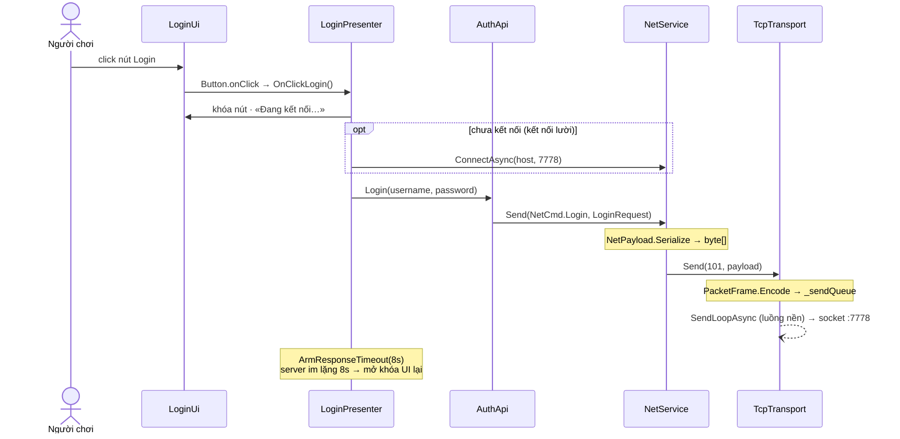
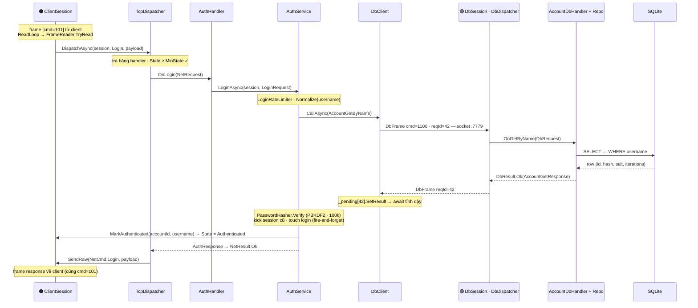
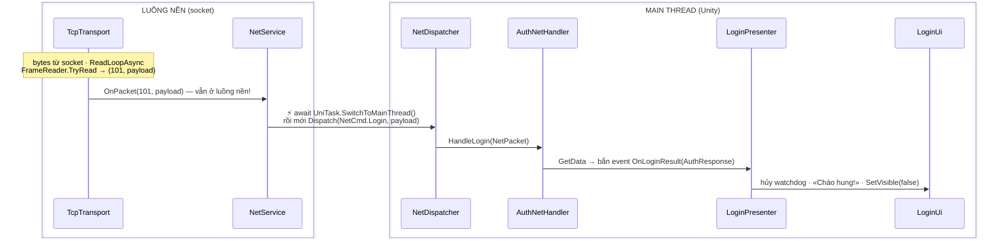
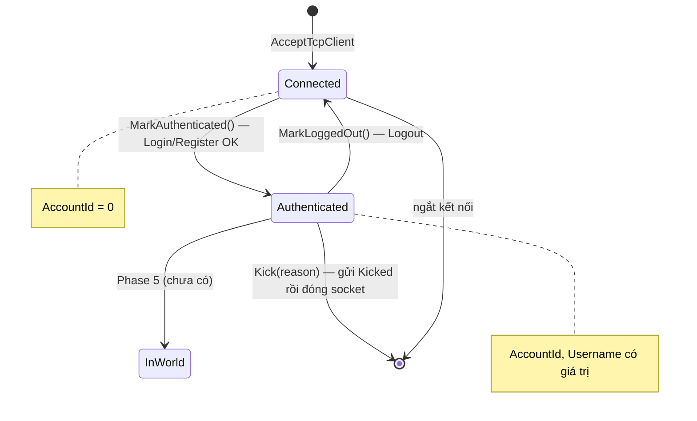

# Hành trình gói tin Login

> Tài liệu giải phẫu luồng mạng của dự án — theo chân **một cú click nút Đăng nhập** đi qua đủ 3 tiến trình
> (Unity Client → GameServer → DBServer) rồi quay về UI. Mọi tên class, method, port, hằng số đều lấy đúng
> từ code hiện tại (Phase 4), có thể mở file đối chiếu từng bước.
>
> 🎨 **Bản trình bày đẹp hơn** (sơ đồ vẽ tay, tô màu theo tiến trình): mở
> [`packet-journey.html`](./packet-journey.html) bằng trình duyệt (clone repo về rồi double-click là được).

**Quy ước màu / ký hiệu xuyên suốt:** 🔵 Unity Client · 🟠 GameServer (`:7778`) · 🟢 DBServer (`:7779`, chỉ loopback).

---

## §1 · Bức tranh lớn: 3 tiến trình, 2 đường TCP, 1 contract

Client không bao giờ chạm DB. Mọi dữ liệu đi theo đúng một chuỗi, và cả 3 bên nói chung một "ngôn ngữ"
là `MMORPG.Shared.dll` — nơi duy nhất định nghĩa `NetCmd`, `DbCmd`, DTO và cách đóng khung byte.

```mermaid
flowchart LR
    subgraph CLIENT["🔵 Unity Client (Assembly-CSharp · VContainer)"]
        direction TB
        UI["LoginUi · LoginPresenter"] --> API["AuthApi"]
        API --> NS["NetService · NetDispatcher"]
        NS --> TT["TcpTransport (FrameReader)"]
    end
    subgraph GS["🟠 GameServer (.NET 8 · 0.0.0.0:7778)"]
        direction TB
        CS["ClientSession (FrameReader)"] --> TD["TcpDispatcher"]
        TD --> AH["AuthHandler · AuthService"]
        AH --> DBC["DbClient"]
    end
    subgraph DBS["🟢 DBServer (.NET 8 · loopback:7779)"]
        direction TB
        DS["DbSession · DbDispatcher"] --> ADH["AccountDbHandler"]
        ADH --> AR["AccountRepository"]
        AR --> SQL[("SQLite mmorpg.db · WAL")]
    end
    TT <-->|"TCP :7778 — PacketFrame"| CS
    DBC <-->|"TCP :7779 — DbFrame"| DS

    SHARED["📦 MMORPG.Shared.dll — nguồn contract duy nhất
    NetCmd · DbCmd · ErrorCode · DTO [MemoryPackable] · PacketFrame · NetPayload · FrameReader · DbFrame"]
    SHARED -.-> CLIENT
    SHARED -.-> GS
    SHARED -.-> DBS
```



Mỗi cột là một **tiến trình riêng** (client build ra game, 2 server là 2 app console). Chúng chỉ nói chuyện
qua TCP; thứ duy nhất "dùng chung" là DLL contract — client nhận bản copy tại `Assets/Plugins/Shared/`
do post-build của `Server/Shared` tự chép sang.

---

## §2 · Data trên dây: byte nào nằm ở đâu

TCP chỉ là một **dòng byte vô tận** — không có khái niệm "gói". Muốn có gói thì tự vẽ ranh giới:
mỗi message được `PacketFrame.Encode` dán một header 8 byte lên đầu, và bên nhận dùng `FrameReader`
gom byte cho đến khi đủ một frame.

### 2.1 · PacketFrame — khung ngoài cùng (Client ↔ GameServer)

```
┌──────────────┬──────────────┬───────────────────────────┐
│ len  : int32 │ cmd  : int32 │ payload (len − 4 byte)    │
└──────────────┴──────────────┴───────────────────────────┘
  little-endian  chìa khóa       = NetPayload, xem 2.2
                 dispatch
  len đo phần [cmd + payload] = 4 + payload.Length (KHÔNG tính chính nó)
```

Ví dụ frame Login:

```
1C 00 00 00   65 00 00 00   00  9A 9F …
(len = 28)    (= 101 →      (flag + 23 byte MemoryPack)
               NetCmd.Login)
```

### 2.2 · NetPayload — ruột của payload

```
flag = 0x00 (thường gặp — auth luôn đi nhánh này):
┌──────┬────────────────────────────────────────────────┐
│ 00   │ MemoryPack(LoginRequest { Username, Password })│
└──────┴────────────────────────────────────────────────┘

flag = 0x01 (chỉ khi DTO > 4 KB — COMPRESS_THRESHOLD):
┌──────┬────────────────┬────────────────────────┐
│ 01   │ rawLen : int32 │ LZ4(MemoryPack bytes)  │
└──────┴────────────────┴────────────────────────┘
```

Nếu nén xong mà to hơn bản gốc → tự quay về flag `0x00`. Login/Register không bao giờ chạm nhánh LZ4.

### 2.3 · DbFrame — GameServer ↔ DBServer (thêm đúng 1 trường)

```
┌──────────────┬──────────────┬────────────────┬────────────────────────────┐
│ len  : int32 │ cmd  : int32 │ reqId : int32  │ NetPayload (flag+MemoryPack)│
└──────────────┴──────────────┴────────────────┴────────────────────────────┘
                 DbCmd, vd 1100  ghép response     vd AccountGetRequest
                                 ↔ request          { Username }
```

Ba tầng đóng gói: **DTO** (object C#) → `NetPayload.Serialize` (MemoryPack + cờ nén) →
`PacketFrame.Encode` (dán `len` + `cmd`). Kênh nội bộ DB dùng lại toàn bộ, chỉ chèn thêm `reqId` —
vì một kết nối DbClient chạy nhiều truy vấn song song, cần biết response nào trả cho request nào (§7).

| Hằng số / dải số | Giá trị | Ghi chú |
|---|---|---|
| `HEADER_SIZE` | 8 | len 4 + cmd 4 |
| `MAX_PACKET_SIZE` | 1 MiB | chặn allocation bomb — `FrameReader` kiểm tra **trước khi** cấp phát |
| `COMPRESS_THRESHOLD` | 4 KB | dưới ngưỡng gửi raw |
| `NetCmd` 1–99 | hệ thống | `Ping=1`, `Error=2`, `Kicked=5` |
| `NetCmd` 100–199 | auth | `Register=100`, `Login=101`, `Logout=102` |
| `DbCmd` 1000+ | nội bộ DB | `AccountGetByName=1100`, `AccountCreate=1101`, `AccountTouchLogin=1102` |

> **Vì sao cần `FrameReader`?** TCP có thể trả về *nửa frame* hoặc *ba frame dính nhau* trong một lần
> `ReadAsync`. `Feed()` dồn byte vào buffer, `TryRead()` chỉ nhả ra khi đã đủ một frame trọn vẹn —
> mỗi kết nối một instance, không thread-safe.

---

## §3 · Chặng 1 — Từ cú click đến socket (phía client)

`LoginUi` chỉ là view câm. `LoginPresenter` là class duy nhất biết cả UI lẫn mạng. Chú ý: client
**gửi rồi quên** — `NetService.Send` không trả về response; presenter tự bật đồng hồ 8 giây
phòng khi server im lặng.



Từ click đến lúc bỏ vào `_sendQueue` đều chạy trên **main thread** của Unity; chỉ `SendLoopAsync`
(Task nền do `ConnectAsync` khởi động) mới thật sự ghi byte ra socket. Nhờ hàng đợi + semaphore,
gameplay không bao giờ bị chặn bởi I/O mạng.

---

## §4 · Chặng 2 — GameServer xử lý & hỏi DBServer

Mỗi client được một `ClientSession` riêng (vòng đời = vòng đời kết nối TCP). `TcpDispatcher` tra bảng
handler dựng sẵn bằng reflection — không có `switch (cmd)` nào cả. Handler gọi service, service gọi DB
qua `DbClient` rồi `await` đến khi response mang đúng **reqId** quay về.



Điểm mấu chốt: `AuthService.LoginAsync` **không tự trả lời client** — nó trả `AuthResponse` cho handler,
handler bọc thành `NetResult.Ok`, và chính `TcpDispatcher` mới gửi đi (mặc định trả lời trên đúng `cmd`
của request). Nếu bất kỳ tầng nào ném exception, dispatcher bắt và gửi `NetCmd.Error` + `ErrorCode`
tương ứng — client không bao giờ bị bỏ đói response vì một bug server.

| Tình huống | Chuyện gì xảy ra |
|---|---|
| **Login thất bại** | Vẫn đi đúng đường này, chỉ khác kết cục: `AuthResponse { Success=false, Error=InvalidCredentials }`. Cố tình dùng chung một mã lỗi + `BurnEquivalentTime()` để kẻ dò không phân biệt được "sai pass" với "không tồn tại user". |
| **DBServer chết** | `DbClient.CallAsync` ném `DbUnavailableException` (hoặc timeout 5s) → `TcpDispatcher` bắt → client nhận `ErrorCode.ServiceUnavailable`. Vòng reconnect của DbClient tự nối lại mỗi 1s. |
| **Đăng nhập nơi thứ hai** | `AuthService` quét `SessionRegistry`, thấy session cũ cùng `AccountId` → gửi `NetCmd.Kicked + KickedNotice` rồi đóng socket cũ. Chính sách: người vào sau thắng. |

---

## §5 · Chặng 3 — Response về client: cú nhảy luồng

Đây là chỗ dễ hiểu sai nhất. Byte từ socket **không** rơi vào main thread — `ReadLoopAsync` của
`TcpTransport` là một Task nền. Đụng bất kỳ Unity API nào ở đó là crash hoặc lỗi câm. Vì vậy
`NetService` luôn `await UniTask.SwitchToMainThread()` *trước khi* dispatch.



Cả dự án chỉ băng qua ranh giới luồng ở đúng một chỗ (`NetService.RaiseOnMainThread`). Nhờ vậy mọi
`[NetHandler]`, mọi event, mọi presenter **mặc định đã ở main thread**, không ai phải tự lo chuyện
thread nữa.

---

## §6 · ClientSession giữ gì — state của một kết nối

"Session" không phải khái niệm trừu tượng: nó là **một object cụ thể** sống cùng một kết nối TCP.
Toàn bộ danh tính người chơi phía server nằm trong nó — client nói gì cũng không đổi được `AccountId`,
chỉ có `MarkAuthenticated()` chạy sau khi kiểm tra mật khẩu mới đổi được.



Số của `SessionState` tăng dần **có chủ đích** (`Connected=0 · Authenticated=1 · InWorld=2`) để
`TcpDispatcher` gác cổng bằng một phép so sánh: handler khai
`[TcpHandler(NetCmd.Logout, MinState = SessionState.Authenticated)]` — session chưa đăng nhập mà gọi
Logout sẽ tự nhận `ErrorCode.NotAuthenticated`, handler không cần tự kiểm tra.

**Bên trong `ClientSession`:**

| Thành phần | Vai trò |
|---|---|
| `Id` / `Tag` | số tự tăng · `"#7"` tô magenta trên log |
| `State : SessionState` | vị trí trong máy trạng thái trên |
| `AccountId` / `Username` | nguồn danh tính duy nhất, **chỉ server ghi** |
| `FrameReader` | ráp frame riêng cho kết nối này |
| `_sendQueue + SemaphoreSlim` | gửi từ luồng nào cũng an toàn |
| `RunAsync()` | ReadLoop + SendLoop; kết thúc là tự gỡ khỏi `SessionRegistry` |

Phía client, "phiên" chỉ là `SessionToken` (64 hex) nằm trong `AuthResponse` — server giữ bảng
`SessionTokens` trong RAM. **Cố tình không gửi `AccountId` cho client.**

---

## §7 · Hai kiểu chờ response — bất đối xứng có chủ đích

Cùng một khái niệm "gửi request rồi nhận response" nhưng hai kênh giải quyết khác hẳn nhau.
Hiểu cặp này là hiểu được vì sao `DbFrame` cần `reqId` còn frame client thì không.

| | 🔵 Client ↔ GameServer | 🟠🟢 GameServer ↔ DBServer |
|---|---|---|
| Kiểu | **Bắn rồi quên** — `Send()` trả `void` | **reqId + await** — `await CallAsync<Req, Res>()` |
| Ghép response | bằng chính `NetCmd` → `NetDispatcher` → event → Presenter | `_pending: { 42 → TaskCompletionSource }` → `TrySetResult` → await tỉnh dậy |
| Song song | mỗi cmd một handler, response đến lúc nào xử lúc đó | nhiều truy vấn bay song song trên **1 kết nối duy nhất**, trả lời được lộn xộn thứ tự |
| Lưới an toàn | watchdog 8s ở `LoginPresenter` | timeout 5s / mất kết nối → `DbUnavailableException` |
| Vì sao chọn | UI là thế giới sự kiện, không được block khung hình | server cần "gọi hàm từ xa" đọc như gọi hàm local |

Chi tiết đáng giảng: `DbSession` phía DBServer cố tình **không await** từng request
(`_ = ProcessAsync(...)`) để một truy vấn chậm không chặn truy vấn sau — chính `reqId` cho phép điều đó.

---

## §8 · Bản đồ class ↔ file — mở đúng chỗ khi giảng lại

| Bước trong hành trình | Class chịu trách nhiệm | File |
|---|---|---|
| 1 · Click nút | `LoginUi` → `LoginPresenter` | `Assets/Game/Scripts/Auth/` |
| 2 · Gom intent thành request | `AuthApi` | `Assets/Game/Scripts/Auth/AuthApi.cs` |
| 3 · Serialize + gửi | `NetService`, `TcpTransport` | `Assets/Game/Scripts/Network/` |
| 4 · Định nghĩa cmd + DTO + khung | `NetCmd`, `AuthDto`, `PacketFrame`, `NetPayload`, `FrameReader` | `Server/Shared/Net/` · `Server/Shared/Dto/` |
| 5 · Nhận kết nối, ráp frame | `Program`, `ClientSession`, `SessionRegistry` | `Server/GameServer/` |
| 6 · Định tuyến theo cmd | `TcpDispatcher` + `[TcpHandler]` | `Server/GameServer/Net/TcpDispatcher.cs` |
| 7 · Logic nghiệp vụ auth | `AuthHandler` → `AuthService` (+ `PasswordHasher`, `LoginRateLimiter`, `SessionTokens`) | `Server/GameServer/Handlers/` · `Auth/` |
| 8 · Gọi DB qua TCP nội bộ | `DbClient`, `DbFrame`, `DbCmd` | `Server/GameServer/Db/DbClient.cs` |
| 9 · Nhận + định tuyến phía DB | `DbSession`, `DbDispatcher` + `[DbHandler]` | `Server/DBServer/` · `Server/DBServer/Net/` |
| 10 · Truy vấn SQLite | `AccountDbHandler` → `AccountRepository` → `Database`/`Migrator` | `Server/DBServer/Handlers/` · `Repositories/` · `Data/` |
| 11 · Nhận response, về main thread | `NetService` → `NetDispatcher` + `[NetHandler]` | `Assets/Game/Scripts/Network/NetDispatcher.cs` |
| 12 · Bắn event, cập nhật UI | `AuthNetHandler` → `LoginPresenter` → `LoginUi` | `Assets/Game/Scripts/Network/Handlers/` · `Auth/` |

---

## §9 · Ba điều dễ quên nhất khi mở rộng

1. **Handler client phải đăng ký tay.** Server quét cả assembly bằng reflection nên handler *static*
   mới tự chạy. Handler client là method *instance* — thiếu dòng
   `builder.Register<XNetHandler>().AsSelf().As<INetHandlerGroup>()` trong `GameLifetimeScope` thì
   object không tồn tại, lệnh rơi vào hư không **mà không có lỗi biên dịch nào**.

2. **Chưa Switch thì chưa đụng Unity.** Mọi callback từ `TcpTransport` đều ở luồng nền. Đường an toàn
   duy nhất về main thread là `await UniTask.SwitchToMainThread()` — trong dự án nó đã nằm sẵn ở
   `NetService`, đừng mở đường thứ hai.

3. **Client chỉ gửi ý định.** UI không tự đổi state (kể cả "đăng nhập thành công") — nó chờ
   `AuthResponse` từ server rồi mới cập nhật. Server là nguồn sự thật; quy tắc này giữ nguyên cho HP,
   vị trí, túi đồ ở các phase sau.
